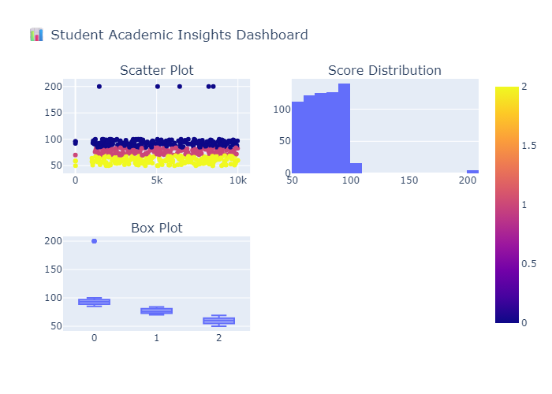

# 🎓 Student Academic Insights Dashboard

##  Overview
The Student Academic Insights Dashboard is an end-to-end data analytics and machine learning project that analyzes student habits, attendance, and academic performance.  

The project focuses on extracting meaningful insights from data, predicting student grade categories, and presenting results through an interactive dashboard.

---

##  Dataset
- **Source:** Provided dataset (`student_performance_updated_1000.csv`)
- **Description:**  
  The dataset contains information about student behavior and academic performance, including:
  - Study habits
  - Attendance
  - Various academic metrics

---

## 🔧 Project Workflow

### 1. Data Cleaning
- Removed missing values
- Eliminated duplicate records
- Standardized column names (lowercase, trimmed spaces)
- Encoded categorical features

---

### 2. Feature Engineering
- Created a unified **`final_score`** column from numeric features
- Generated **grade categories**:
  - A (85+)
  - B (70–84)
  - C (50–69)
  - D (<50)

---

### 3. Exploratory Data Analysis (EDA)
- Correlation heatmap to identify relationships
- Score distribution analysis
- Feature vs performance visualizations
- Identified key factors affecting student outcomes

---

###  4. Machine Learning Model
- **Algorithm:** Random Forest Classifier  
- **Objective:** Predict student grade category  
- **Steps:**
  - Label encoding of target variable
  - Train-test split (80/20)
  - Model training and evaluation

---

## Model Performance
- **Accuracy:** XX% *(update after running your code)*  
- **Evaluation Metrics:**
  - Precision
  - Recall
  - F1-score
  - Confusion Matrix

---

## Interactive Dashboard
- Built using **Plotly**
- Combines multiple visualizations:
  - Scatter plot (feature vs score)
  - Score distribution histogram
  - Grade-wise box plot
- Exported as:
  - `dashboard.html` (interactive)
  - `dashboard.png` (static image)

---

## 📈 Key Insights
- Student performance is strongly influenced by behavioral factors
- Attendance plays a significant role in grade outcomes
- Certain features have higher predictive importance in the ML model
- Data-driven insights can help improve academic strategies

---

## Dashboard Preview
